<div align="center">
  <h1>Voice Integrity</h1>
  <p><b>Real-time detection of AI voice cloning and impersonation attacks for live communication.</b></p>
  
  <br>

  [**Live Demo**](https://voicenow.vercel.app) · 
  [**WavLM Expert Model**](https://huggingface.co/sarosh22/wavLM-Hybrid) · 
  [**LFCC Expert Model**](https://huggingface.co/sarosh22/Final_LFCC) ·
  [**GitHub Repository**](https://github.com/Akenzz/SIH26104-Prevention-of-Voice-Cloning-Impersonation-Attacks)
</div>

<br>

<div align="center">
  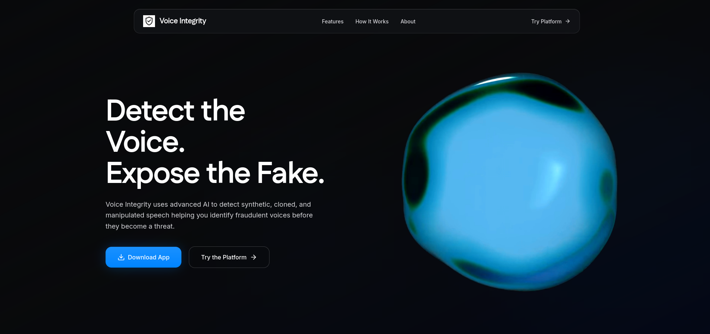
</div>

<br>

---

## Quick Start

### Try the Live Product
[voicenow.vercel.app](https://voicenow.vercel.app)

### Run Locally

1. **Clone the repository**:
   ```bash
   git clone https://github.com/Akenzz/SIH26104-Prevention-of-Voice-Cloning-Impersonation-Attacks.git
   cd SIH26104-Prevention-of-Voice-Cloning-Impersonation-Attacks
   ```
2. **Start all services**:
   ```bash
   ./run_all.sh
   ```

*(See the detailed [Installation](#installation) section for manual execution and Docker setups).*

---

## System at a Glance

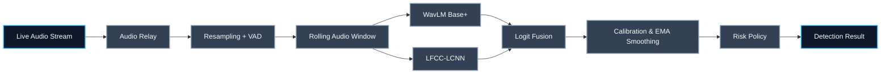

---

## Table of Contents

1. [Executive Overview](#executive-overview)
2. [Problem Statement](#problem-statement)
3. [Solution](#solution)
4. [Current Status](#current-status)
5. [Key Capabilities](#key-capabilities)
6. [Repository Structure](#repository-structure)
7. [Product Flow](#product-flow)
8. [System Architecture](#system-architecture)
9. [Deployment Architecture](#deployment-architecture)
10. [Scalability](#scalability)
11. [Inference Sequence](#inference-sequence)
12. [Technology Stack](#technology-stack)
13. [Screenshots & Demo](#screenshots--demo)
14. [AI / ML Architecture](#ai--ml-architecture)
15. [Voice Processing Pipeline](#voice-processing-pipeline)
16. [Model Architecture](#model-architecture)
17. [Training Pipeline](#training-pipeline)
18. [Dataset](#dataset)
19. [Evaluation](#evaluation)
20. [Model Artifacts](#model-artifacts)
21. [Why This Architecture?](#why-this-architecture)
22. [Inference Details](#inference-details)
23. [Offline & On-Device Inference](#offline--on-device-inference)
24. [Security & Privacy](#security--privacy)
25. [Limitations](#limitations)
26. [Roadmap](#roadmap)
27. [Prerequisites](#prerequisites)
28. [Installation](#installation)
29. [Environment Variables](#environment-variables)
30. [Running Locally](#running-locally)
31. [API Documentation](#api-documentation)

---

## Executive Overview

**Voice Integrity** is a production-grade, real-time deepfake speech detection pipeline engineered to intercept and flag AI voice cloning attacks during live phone calls. 

As generative voice models achieve zero-shot human parity, traditional biometric security and human intuition are no longer sufficient to verify caller identity. Voice Integrity solves this by capturing live audio streams, buffering them into continuous rolling windows, and evaluating the acoustic footprint against two parallel ML expert models. 

Designed for telecoms, enterprise call centers, and end-users, the system delivers an instantaneous 4-band risk assessment (Low, Uncertain, High) alongside a live forensic reasoning trace generated by a Large Language Model—providing both mathematical confidence and human-readable context in under 250 milliseconds.

---

## Problem Statement

Voice cloning technologies (such as XTTS, RVC, and flow-matching TTS) have reached a point where high-fidelity impersonation can be achieved with less than 10 seconds of reference audio. When injected into live communication channels like cellular phone calls or WebRTC streams, these deepfakes easily bypass traditional security protocols and socially engineer victims.

Current detection solutions suffer from critical flaws:
1. **Offline Only**: Most models evaluate entire audio files offline, failing to provide the instantaneous protection required for live calls.
2. **Network Compression Vulnerability**: Telephone networks and VoIP systems heavily compress audio (e.g., brickwalling frequencies at 8kHz). Simple frequency detectors that rely on high-fidelity studio artifacts fail entirely in real-world telephony environments.
3. **Black Box Decisions**: A simple "95% Fake" score provides zero context to the user, making it difficult to trust the system during a high-stakes conversation.

---

## Solution

Voice Integrity acts as an active middleware interceptor. It addresses the real-world constraints of telephony deepfake detection through a multi-tiered architecture:

* **Backend Processing**: A robust WebSocket streaming engine that handles polyphase resampling, strict Voice Activity Detection (VAD) using RMS silence gating, and stream continuity management.
* **AI/ML Detection Ensembling**: Evaluates audio across two specialized, parallel axes:
  1. **Waveform Analysis (WavLM)**: A deep transformer-based representation model that catches neural TTS patterns.
  2. **Frequency-Domain Analysis (LFCC-LCNN)**: A linear-frequency model with a strict **7,000 Hz parity gate** designed specifically to strip out resampling and network compression biases, forcing the model to detect true spoofing artifacts rather than audio quality differences.
* **Result Generation**: Raw logits are fused via heuristic weighting, individually calibrated using Platt Scaling, and temporally smoothed via Exponential Moving Averages (EMA) to prevent erratic UI jitter.
* **User-Facing Context**: Decisions are bucketed into a strict 4-band policy, while a Groq-powered LLM translates the telemetry into a live forensic narrative for the end-user.

---

## Current Status

| Component | Status |
|---|---|
| Web Application | 🟢 Implemented |
| Realtime Backend | 🟢 Implemented |
| Dual-Model Inference | 🟢 Implemented |
| Training Pipeline | 🟢 Implemented |
| Mobile Application | 🟢 Implemented |
| Offline Inference | 🔵 Planned / In Development |
| Blockchain Audit Log | 🔵 Planned |
| On-Device Mobile Inference | 🔵 Planned |

---

## Key Capabilities

| Capability | Description | Status |
|---|---|:---:|
| **Real-time Dual-Expert Inference** | Ensembles WavLM Base+ and LFCC-LCNN for comprehensive coverage against both conversion and generation attacks. | 🟢 Active |
| **Live Audio Relay & Crossfading** | Python microservice simulating 2-phone networks with raised-cosine crossfading to prevent spoof injection artifacts on small chunks. | 🟢 Active |
| **LLM Reasoning Trace** | Streams Groq-powered, token-by-token forensic explanations of the risk score to the user interface. | 🟢 Active |
| **Temporal Smoothing (EMA)** | Applies Exponential Moving Average across overlapping windows to prevent UI jitter and stabilize policy decisions. | 🟢 Active |
| **4-Band Risk Policy** | Translates continuous, calibrated probabilities into `Low`, `Uncertain`, `High`, and `Unavailable` action bands. | 🟢 Active |
| **MockRVC AudioWorklet** | Runs pitch/formant warping directly in-browser to simulate live spoofing attacks without secondary hardware. | 🟢 Active |
| **Blockchain Audit Log** | Tamper-evident hash chain of verified call signatures and historical risk scores. | 🔴 Planned |
| **On-Device Mobile Inference** | Running the ML models natively on Android/iOS via TFLite/ONNX to eliminate network latency. | 🔴 Planned |

---

## Repository Structure

```text
├── data_pipeline/             # Dataset generation and manifest creation scripts
├── lfcc-detector/             # LFCC-LCNN training, gating, and extraction logic
├── realtime-backend/          # FastAPI WebSocket server for dual-expert inference
├── relay-service/             # Audio middleware for crossfading and mock networks
├── testdata/                  # Sample audio for offline evaluation tests
├── voice-integrity-frontend/  # React/Vite dashboard for live monitoring
├── voice_integrity_flutter/   # Flutter mobile application
├── wavlm-base-plus/           # WavLM classification head training scripts
├── run_all.sh                 # One-click start script for local development
└── docker-compose.yml         # Containerized multi-service deployment
```

---

## Product Flow

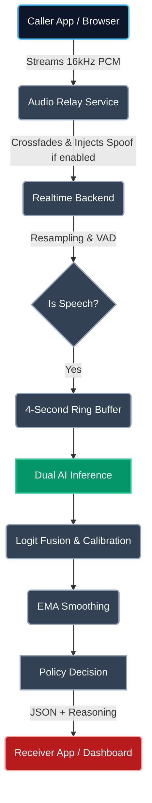

---

## System Architecture

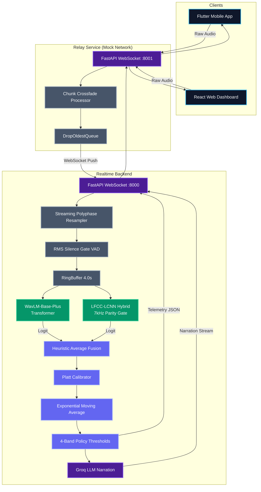

---

## Deployment Architecture

### Current Implementation
The current repository utilizes a localized, tightly-coupled microservice architecture designed for a single compute node (or local development). The `relay-service` acts as a mock telephony network, forwarding raw PCM chunks to the `realtime-backend`, which loads both PyTorch experts directly into unified process memory and processes requests sequentially per WebSocket connection.

### Production-Scale Architecture
For enterprise deployment (e.g., telecom integrations handling 1,000+ concurrent calls), the architecture must evolve to decouple audio ingestion from model inference. 

*(This represents proposed future infrastructure, not currently implemented in this repository).*

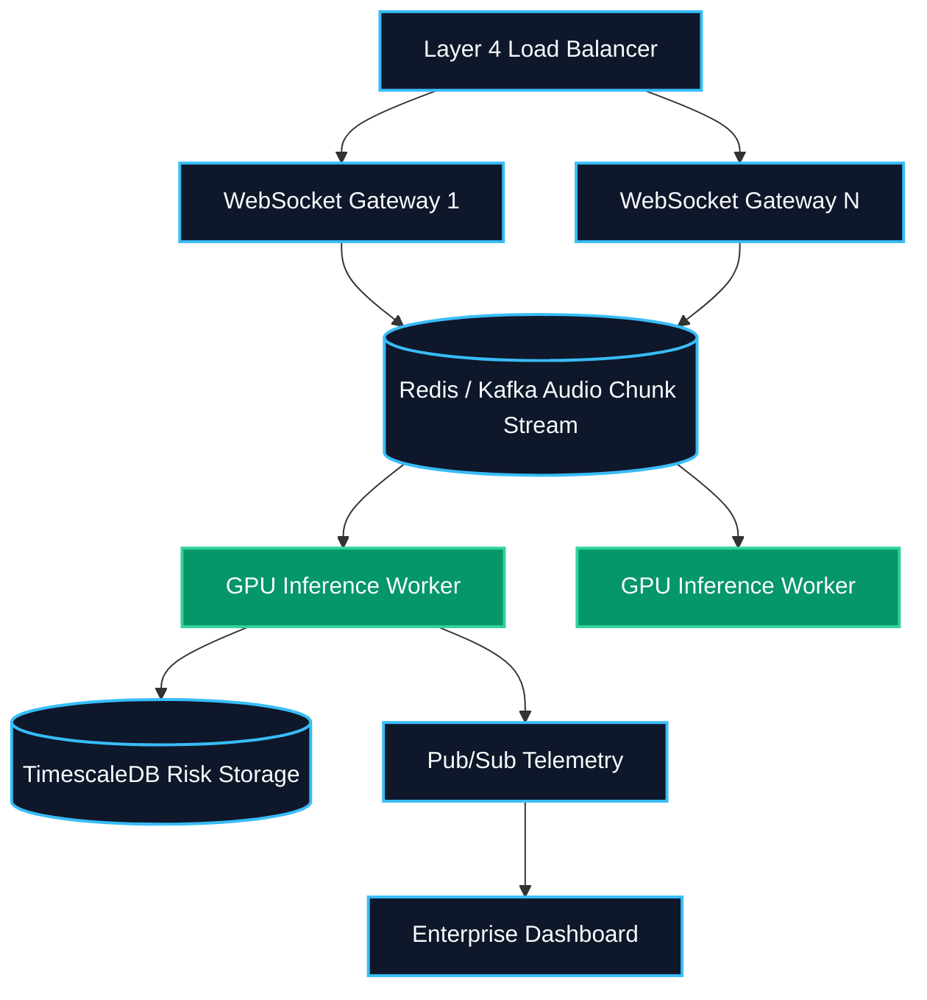

---

## Scalability

### CURRENT
The system currently scales vertically. The backend is bound by the processing speed of the WavLM Base+ transformer. On a modern CPU (`DEVICE=cpu`), processing a 4-second chunk takes ~150-300ms. On an NVIDIA GPU (`DEVICE=cuda`), this drops to <30ms, allowing a single backend instance to handle ~30-50 concurrent audio streams before running into Python Global Interpreter Lock (GIL) and WebSocket I/O bottlenecks.

### FUTURE SCALE-UP
To achieve true horizontal scalability:
* **Decoupled Model Serving**: Move PyTorch models out of the FastAPI process and into dedicated Triton Inference Servers or TorchServe containers.
* **Queue-Based Processing**: Replace direct WebSocket-to-Model synchronous calls with a high-throughput message broker (like Kafka or Redis Streams) to buffer audio chunks during traffic spikes.
* **Stateless Gateways**: Terminate WebSocket connections at a horizontally scaled, stateless Node.js/Go gateway layer that only handles routing, pushing raw audio to the internal broker.

---

## Inference Sequence

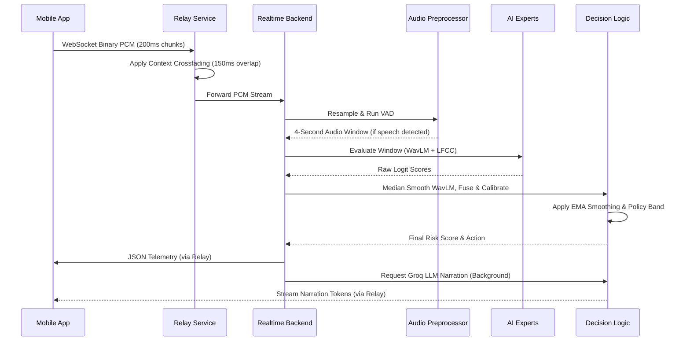

---

## Technology Stack

| Category | Technologies Used |
|---|---|
| **Frontend** | React, Vite, Tailwind CSS, JavaScript |
| **Mobile App** | Flutter, Dart |
| **Backend** | Python, FastAPI, WebSockets, Uvicorn |
| **AI/ML** | PyTorch, Torchaudio, Transformers (Hugging Face) |
| **Audio Processing** | NumPy, SciPy, librosa, AudioWorklet |
| **LLM Integration** | Groq API |
| **Infrastructure / DevOps** | Docker, Docker Compose, Vercel |

---

## Screenshots & Demo

### Live Monitor Dashboard

<div align="center">
  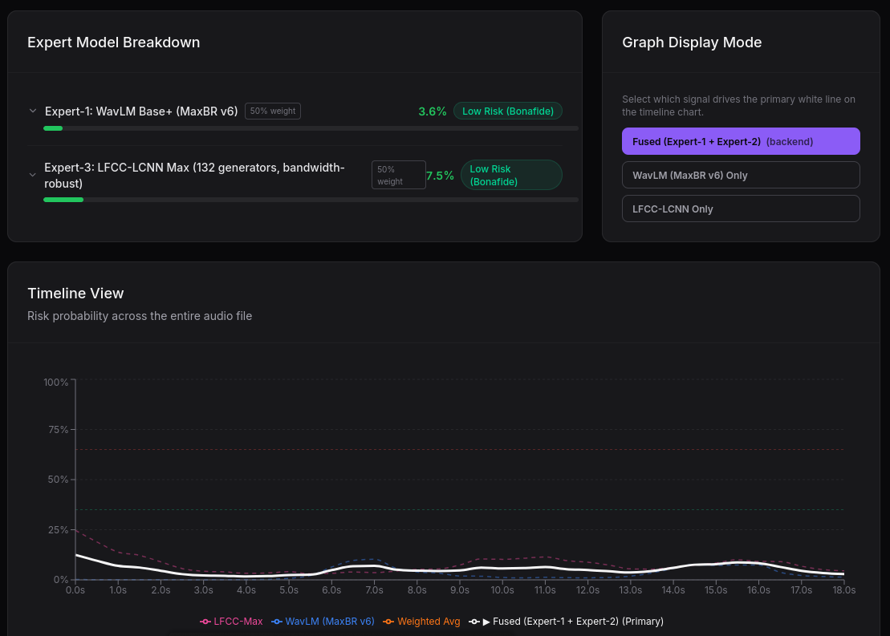
</div>

### Flutter Mobile App

<div align="center">
  
</div>

---

## AI / ML Architecture

Voice Integrity employs a dual-expert ensembling strategy to capture deepfake artifacts across two entirely orthogonal domains. Advanced neural vocoders (like those in RVC or XTTS) often produce spoofed audio that sounds acoustically flawless in the time domain, but exhibits highly unnatural statistical footprints in the spectral envelope.

By analyzing both waveform (deep representation) and frequency (spectral shape) domains in parallel, and heuristically fusing their calibrated logits, the system achieves maximum coverage against both known attacks and unseen zero-day generative models.

---

## Voice Processing Pipeline

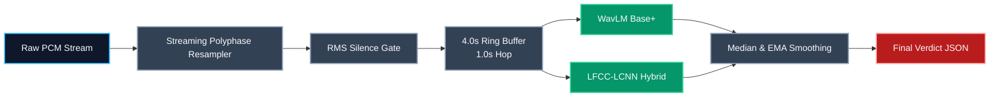

**Why VAD and Chunking?**
- **VAD (Voice Activity Detection)**: Absolute silence lacks any acoustic artifacts. Feeding dead air into the classifiers heavily biases predictions toward a "bonafide" baseline and ruins temporal stability. The RMS gate drops frames that don't contain structural speech energy.
- **4.0s Chunking / 1.0s Hop**: Traditional deepfake detectors operate on complete offline files. The overlapping chunking system enables Voice Integrity to perform true streaming inference, feeding 4-second context windows to the models every 1 second to deliver continuous live scoring with <250ms backend latency.

---

## Model Architecture

| Component | WavLM Expert | LFCC-LCNN Hybrid |
|---|---|---|
| **Model** | WavLM Base+ Classifier | LFCC-LCNN with Feature Extraction |
| **Architecture** | Frozen `microsoft/wavlm-base-plus` transformer backbone with a trainable 2-layer linear classification head. | Linear Frequency Cepstral Coefficients (LFCC) feeding a Light Convolutional Neural Network (LCNN). |
| **Input** | 16kHz Raw Waveform | 16kHz Raw Waveform |
| **Preprocessing** | None (Raw Audio) | 7,000 Hz Parity Lowpass Gate + LFCC Extraction |
| **Output** | Spoof probability logit | Spoof probability logit |
| **Training** | Head-only fine-tuning (AdamW, LR `1e-3`) | Full fine-tuning (AdamW, LR `5e-5`) |
| **Inference** | Forward pass on standard `torch` tensors. | Forward pass with internal 7kHz gate and feature extraction. |
| **Role** | Catches deep representation anomalies and broad neural TTS semantic patterns. | Identifies high-frequency statistical artifacts, spectral shape distortion, and specific vocoder artifacts. |

---

## Training Pipeline

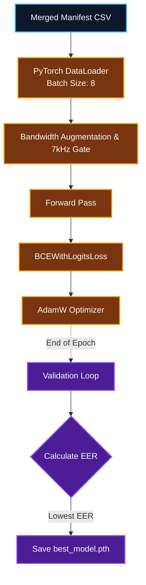

**Training Configuration (Verified)**
- **Batch Size**: 8 (Memory-optimized to prevent CUDA OOM on standard consumer hardware).
- **Epochs**: 6 (LFCC bandwidth fine-tuning) / 10 (WavLM head training).
- **Loss Function**: Binary Cross-Entropy with Logits (`BCEWithLogitsLoss`).
- **Evaluation**: Per-epoch ROC-AUC & Equal Error Rate (EER) calculation on a strict speaker-disjoint dev split.
- **Checkpointing**: The model with the lowest Dev EER is saved automatically, while the `final.pth` checkpoint is retained for crash recovery.

---

## Dataset

The training corpus consists of **84,271 VAD-filtered audio chunks** across 6 languages, sourced from a heavily curated mix of datasets designed to prevent label proxies:

* **Sources**: AI4Bharat Kathbath (Hindi/Kannada), Gramvaani GV_Train, ASVspoof 2019 LA, MLAAD, and In-The-Wild.
* **Spoof Generators**: 132 distinct generative models (TTS and Voice Conversion) were exposed during training.
* **Matched-Pair Self-Generation**: To prevent the model from learning Hindi as a proxy for "real speech", perfectly matched spoof pairs were generated for the Kathbath dataset using **IndicF5** and **XTTS-v2**. 
* **Data Organization**: A central `.csv` manifest tracks path, label, speaker_id, and generator_id, guaranteeing zero speaker overlap between train and dev splits. In-The-Wild audio was permitted in the training pool, but a disjoint speaker slice was reserved exclusively for out-of-domain evaluation.

---

## Evaluation

Metrics are logged strictly on held-out speakers and unseen generators to reflect true zero-day defense capability.

| Evaluation Metric | Target Data Split | Measured Result | Context |
|---|---|---:|---|
| **WavLM Dev EER** | Platt calibration dev split | **1.50%** | Baseline representation model error rate |
| **LFCC In-Domain EER** | Held-out speakers, seen generators | **7.44%** | Accuracy of the linear frequency backbone |
| **Spoof Recall (Zero-Day)** | `eval_ood` (25 unseen generators) | **91.5%** | Evaluated using the deployed `p >= 0.65` threshold with a False Alarm rate of only **1.7%** |
| **Hard-Negative Constraint** | Optispeech / Ultra-high fidelity | **26.9%** | Represents the upper boundary of current zero-day capability |

---

## Model Artifacts

Pre-trained weights and Platt calibration mappings are loaded directly from Hugging Face during environment startup:

* **WavLM Expert**: [sarosh22/wavLM-Hybrid](https://huggingface.co/sarosh22/wavLM-Hybrid)
* **LFCC Expert**: [sarosh22/Final_LFCC](https://huggingface.co/sarosh22/Final_LFCC)

---

## Why This Architecture?

* **Why Transformer + LCNN?**: Transformers (WavLM) excel at learning deep, long-range contextual relationships in raw waveforms but can jitter window-to-window. LCNNs operate on explicit acoustic features (LFCCs), providing a fast, computationally cheap check against known spectral spoofing patterns.
* **Why the 7,000 Hz Parity Gate?**: A critical pipeline bug was discovered during offline testing. The training resampler (`librosa`) brickwalled audio at 7.9kHz, while the inference resampler (`scipy`) did not. Because native 16kHz audio was overwhelmingly bonafide, the models secretly learned that "high frequency energy = real phone call." We engineered a hard 7,000 Hz lowpass gate directly inside the model feature extractor to blind it to resampler fingerprints entirely, restoring zero-day reliability.
* **Why Median before EMA?**: WavLM's extreme sensitivity causes single-window outlier spikes. An 8-window median buffer mathematically eliminates these spikes *before* they corrupt the fusion layer, allowing the downstream Exponential Moving Average (EMA) to cleanly track genuine probability shifts without UI jitter.

---

## Inference Details

The decision pipeline translates raw neural outputs into a human-readable risk policy in real-time.

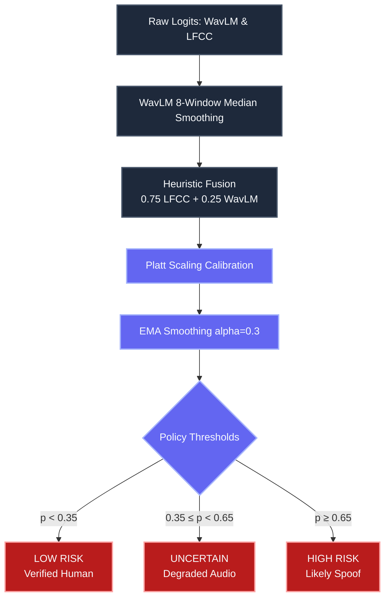

---

## Offline & On-Device Inference

### Current Status
The current implementation **strictly requires backend network connectivity**. Inference is performed on the `realtime-backend` Python server, meaning the frontend/mobile app must stream raw audio over WebSockets continuously. 

### Why On-Device Inference Is Feasible
Deepfake detection traditionally requires massive, centralized compute. However, the dual-expert architecture of Voice Integrity is highly compressible:
1. The **LFCC-LCNN** model is exceptionally lightweight, operating primarily on 1D convolutions over extracted frequency features. 
2. The **WavLM** model can be quantized (INT8) or replaced entirely with a distilled student model for edge deployments.

Moving inference directly to the mobile device (Edge AI) would eliminate network latency, significantly reduce cloud compute costs, and completely protect user privacy by never transmitting raw voice data.

### Potential Architecture
*(Proposed implementation for future mobile releases)*

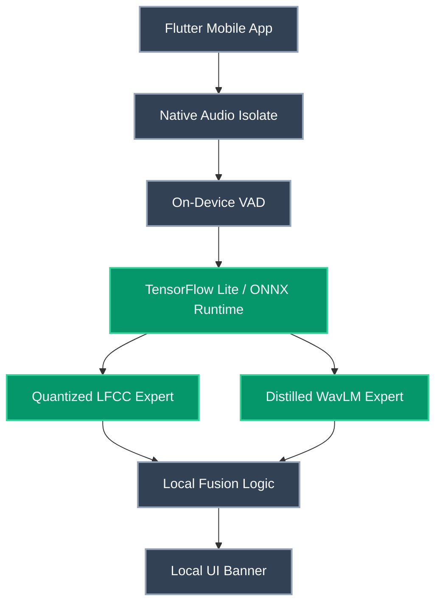

---

## Security & Privacy

### Current Security Measures
* **Ephemeral Audio**: The `realtime-backend` and `relay-service` process audio exclusively in memory (RAM) via a rolling 4-second `RingBuffer`. Audio chunks are continuously overwritten and are **never written to disk**.
* **Environment Variables**: Sensitive keys (like `GROQ_API_KEY`) are managed strictly through `.env` files and are never hardcoded or exposed to the client interface.

### Production Security Considerations
For enterprise deployment, the following must be implemented:
* **Transport Encryption**: All `ws://` endpoints must be upgraded to `wss://` (WebSocket Secure) with proper TLS termination at the load balancer.
* **Authentication**: Introduce JWT (JSON Web Token) authorization for the WebSocket handshake to prevent unauthorized API consumption.
* **PII Redaction**: If forensic reasoning logs (Groq LLM) are persisted, a local PII redaction layer must scrub names and numbers before storage.

---

## Limitations

* **Hard-Negative Spoof Engines**: The model struggles with certain ultra-high fidelity internal systems like Optispeech (26.9% recall), defining the upper boundary of our current zero-day detection capability.
* **Latency Spikes**: Running entirely on `DEVICE=cpu` without a GPU can introduce inference latency exceeding the 250ms target for 4-second chunk processing.
* **Language Biases**: While 6 languages were covered, extremely low-resource dialects not represented in the Kathbath or Gramvaani datasets may occasionally trigger false alarms due to novel phonetic structures.

---

## Roadmap

### Near Term
- [ ] Stabilize the offline `.wav` file analysis endpoint for batch evaluation.
- [ ] Add explicit language-identification logging to trace dialect-based false positive rates.

### Medium Term
- [ ] Export both WavLM and LFCC experts to ONNX runtime.
- [ ] Implement Mobile TFLite / ONNX inference directly on Android to eliminate the backend network dependency.

### Long Term
- [ ] Integrate a tamper-evident blockchain audit log for call verification signatures.
- [ ] Production integration with enterprise telecom SIP trunks.

---

## Prerequisites

To run Voice Integrity locally, ensure your system meets the following requirements:

* **OS**: Linux, macOS, or Windows (WSL2 recommended)
* **Python**: 3.10 or higher
* **Node.js**: 18.0 or higher
* **GPU**: A CUDA-enabled NVIDIA GPU is highly recommended for low-latency streaming inference, but CPU-only inference (`DEVICE=cpu`) is fully supported.

---

## Installation

### Backend (Realtime API)

```bash
cd realtime-backend
python -m venv .venv
source .venv/bin/activate
pip install -r ../requirements.txt
```

### Relay Service (Audio Middleware)

```bash
cd relay-service
python -m venv .venv
source .venv/bin/activate
pip install -r ../requirements.txt
```

### Frontend (React Dashboard)

```bash
cd voice-integrity-frontend
npm install
```

### Mobile Application

```bash
cd voice_integrity_flutter
flutter pub get
```

---

## Environment Variables

Configuration is handled via `.env` files in both the `realtime-backend` and `relay-service` directories. Copy `.env.example` to `.env` to customize. 

*Note: The system defaults to production-safe values if no `.env` is provided.*

| Variable | Required | Purpose | Example |
|---|---|---|---|
| `GROQ_API_KEY` | No | Enables the LLM forensic reasoning trace. If unset, the backend falls back to offline templates. | `gsk_abc123...` |
| `DEVICE` | No | Forces PyTorch to use a specific hardware accelerator. | `cpu`, `cuda` |
| `EXPERTS` | No | Comma-separated list of models to load into memory. | `wavlm,hybrid_maxbr` |
| `FUSION_MODE` | No | Defines how multiple experts are combined. | `heuristic_avg`, `single` |
| `CALIBRATOR_PATH` | No | The JSON Platt scaling mappings for the active experts. | `artifacts/calibrator_hybrid_maxbr.json` |

---

## Running Locally

### Option 1: One-Click Script (Recommended)

The easiest way to start both the Python backend and the React frontend simultaneously:

```bash
./run_all.sh
```

### Option 2: Docker Compose

For a fully isolated containerized deployment:

```bash
docker-compose up --build
```

### Option 3: Manual Execution

If you need to view separate console streams or debug specific microservices, start them in three separate terminals:

**Terminal 1 (AI Backend - Port 8000)**
```bash
cd realtime-backend
source ../.venv/bin/activate
python server.py
```

**Terminal 2 (Relay Service - Port 8001)**
```bash
cd relay-service
source ../.venv/bin/activate
python server.py
```

**Terminal 3 (React Frontend)**
```bash
cd voice-integrity-frontend
npm run dev
```

The frontend will automatically connect to the Relay Service on port `8001`, which acts as a simulated phone network and forwards audio to the AI Backend on port `8000`.

---

## API Documentation

### Realtime Backend (`:8000`)

#### `WS /ws`
**Purpose**: Main streaming inference pipeline. Accepts continuous binary audio and returns live JSON telemetry.
**Request**: 16kHz PCM Binary frames.
**Response**: 
```json
{
  "event": "evaluation",
  "probability": 0.85,
  "risk_state": "High",
  "smoothed_probability": 0.81
}
```

#### `GET /health`
**Purpose**: Heartbeat and configuration summary of the loaded ML experts.

#### `POST /predict-file`
**Purpose**: Offline evaluation for testing entire pre-recorded audio files.
**Request**: `multipart/form-data` with a `.wav` file attached as `file`.
**Response**: 
```json
{
  "event": "summary",
  "overall_risk_state": "high",
  "confidence_level": "high",
  "final_smoothed_probability": 0.91,
  "total_windows_count": 14,
  "spoof_windows_count": 12
}
```

#### `POST /narrate`
**Purpose**: Generates streaming forensic reasoning using Groq LLM based on telemetry.
**Request**: 
```json
{
  "probability": 0.85,
  "risk_state": "high",
  "call_context": "banking"
}
```

### Relay Service (`:8001`)

#### `WS /ws/caller`
**Purpose**: Ingests audio from the mobile/web client simulating the caller. Handles simulated context crossfading.

#### `WS /ws/receiver`
**Purpose**: Streams the AI backend's telemetry JSON directly to the receiver dashboard so they can monitor the caller's risk level.

#### `POST /api/session/{session_id}/spoof`
**Purpose**: Toggles mock deepfake injection for the current session.
**Request**:
```json
{
  "enabled": true
}
```
